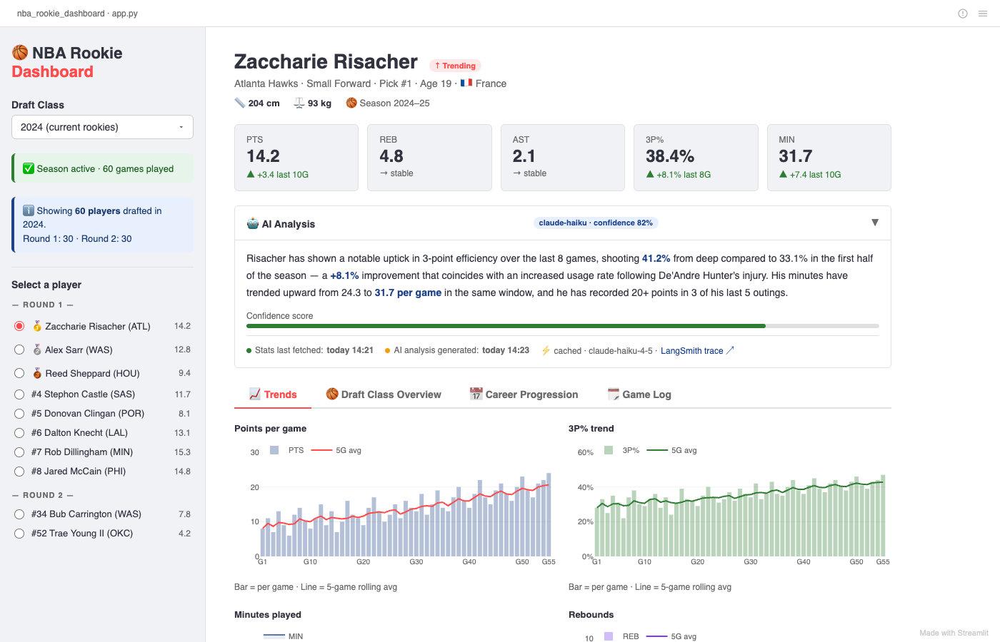
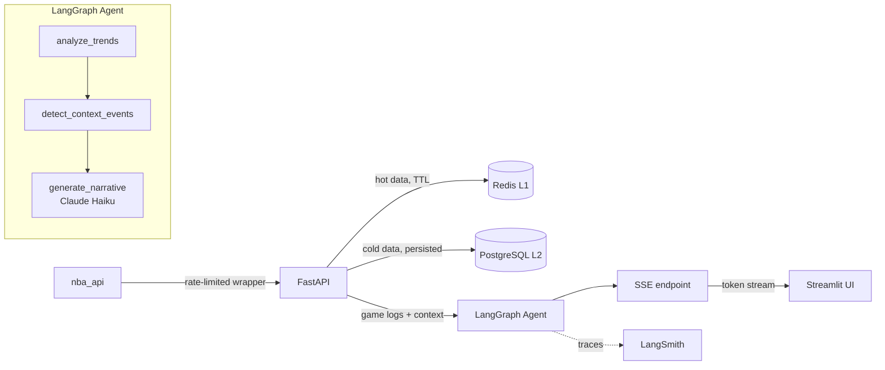

# 🏀 NBA Rookie Dashboard

> **Status: Early MVP — in active development**

An analytics dashboard that tracks NBA rookie statistics and generates AI-powered narrative analysis using a **LangGraph agent**, **Claude Haiku**, and a two-level cache (Redis + PostgreSQL). Built as a portfolio project for an AI Engineer role.


*UI mockup — implementation in progress*

---

## What it does

Select a draft class (2020–2024), pick a rookie, and get:

- **Live stats** — points, rebounds, assists, 3P%, minutes with trend deltas
- **Rolling averages** — 5/10/15-game windows overlaid on Plotly charts
- **AI narrative** — streamed token-by-token via SSE, generated by a 3-node LangGraph agent that detects trends, identifies context events (DNP gaps, role changes), and calls Claude Haiku with structured output
- **Confidence score** — calibrated from data volume and trend signal strength
- **Draft Class Overview** — stacked bar chart comparing all rookies in a class
- **Career Progression** — season-over-season view per player

---

## Architecture



**Key design decisions:**

| Decision | Why |
|---|---|
| LangGraph over a simple chain | Explicit state (`AgentState` TypedDict) between trend analysis and narrative generation — easier to eval and debug each node independently |
| Two-level cache (Redis + PostgreSQL) | Redis handles sub-second hot reads; PostgreSQL persists historical data and narrative timestamps across restarts |
| SSE over polling | Streaming UX for narrative — user sees tokens appear, not a spinner for 2–3s |
| Lazy refresh on MVP, APScheduler for prod | `nba_api` rate-limits to 0.5 req/s; background job at 02:00 ET pre-fetches all rookies so daytime requests hit cache |
| Evaluation-first | Golden dataset (10–15 examples) + LLM-as-judge metrics defined before the prompt is tuned |

---

## Tech stack

| Layer | Tech |
|---|---|
| Data source | `nba_api` |
| Cache L1 | Redis (TTL-based, hot data) |
| Cache L2 | PostgreSQL + Alembic |
| API | FastAPI + SSE (`asyncio` streaming) |
| AI agent | LangGraph + Anthropic Claude Haiku |
| AI observability | LangSmith |
| Frontend | Streamlit + Plotly |
| Config | `pydantic-settings` |
| Tooling | Poetry, Ruff, mypy (strict), Black, pytest |

---

## Project status

`[██░░░░░░░░] 12%` — Early MVP, active development

| Epic | | Status |
|---|---|---|
| 1 · Infrastructure & tooling | 🔄 | In progress |
| 2 · NBA data pipeline (Redis + PostgreSQL) | ⏳ | Planned |
| 3 · Season / draft logic | ⏳ | Planned |
| 4 · Stats aggregation + rolling averages | ⏳ | Planned |
| 5 · LangGraph AI narrative engine | ⏳ | Planned |
| 6 · Streamlit dashboard | ⏳ | Planned |
| 7 · Evaluation suite | ⏳ | Planned |
| 8 · Portfolio & deploy | ⏳ | Planned |

---

## Quickstart (coming soon)

```bash
cp .env.example .env   # fill in ANTHROPIC_API_KEY, LANGCHAIN_API_KEY
make dev               # docker compose up — API + UI + Redis + PostgreSQL
# open http://localhost:8501
```

Full setup guide will be added once the first working build is ready.

---

## Evaluation

The narrative engine is designed to be testable:

- **Golden dataset** — 10–15 `(player_stats, expected_narrative)` pairs
- **LLM-as-judge** — factual accuracy (does the trend direction match the numbers?), hallucination check, confidence calibration
- **CI gate** — `make eval` runs against the golden set; PRs blocked if accuracy drops below threshold

---

## Local development

```bash
make install-dev   # poetry install --with dev
make check         # format-check + ruff + mypy
make test          # pytest
make eval          # golden dataset eval
```
