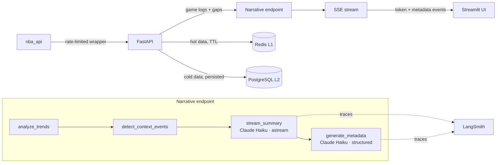

# 🏀 NBA Rookie Dashboard

> **Status: Full-stack MVP + evaluation + deploy prep complete — production deploy remaining**

An analytics dashboard that tracks NBA rookie statistics and generates AI-powered narrative analysis with **Claude Haiku**, streamed via SSE, backed by a two-level cache (Redis + PostgreSQL).


---

## What it does

Select a draft class (2020–2024), pick a rookie, and get:

- **Live stats** — points, rebounds, assists, 3P%, minutes with trend deltas
- **Rolling averages** — 5/10/15-game windows overlaid on Plotly charts
- **AI narrative** — streamed token-by-token via SSE; the endpoint composes pure trend and context analysis with a two-call Claude Haiku pattern (plain-text streaming for the summary, structured output for trend direction and confidence)
- **Confidence score** — calibrated from data volume and trend signal strength
- **Draft Class Overview** — stacked bar chart comparing all rookies in a class
- **Career Progression** — season-over-season view per player

---

## Architecture



**Key design decisions:**

| Decision | Why |
|---|---|
| Plain async composition over an orchestration framework | A linear three-step pipeline whose middle step needs to stream doesn't earn a graph — pure functions and direct calls stay easier to test, trace, and swap transports on |
| Two-call narrative pattern (stream + classify) | LangChain `with_structured_output` streams JSON fragments, not prose. Splitting into a plain-text streaming call and a structured metadata call keeps both UX and validation. |
| Two-level cache (Redis + PostgreSQL) | Redis handles sub-second hot reads; PostgreSQL persists historical data and narrative timestamps across restarts |
| SSE over polling | Streaming UX for narrative — user sees tokens appear, not a spinner for 2–3s |
| Lazy refresh on MVP, APScheduler for prod | `nba_api` rate-limits to 0.5 req/s; background job at 02:00 ET pre-fetches all rookies so daytime requests hit cache |
| Evaluation-first | Golden dataset (10–15 examples) + LLM-as-judge metrics defined before the prompt is tuned |

---

## Tech stack

| Layer | Tech |
|---|---|
| Data source | `nba_api` |
| Cache L1 | Redis (TTL-based, hot data) |
| Cache L2 | PostgreSQL + Alembic |
| API | FastAPI + SSE (`asyncio` streaming) |
| AI generation | LangChain + Anthropic Claude Haiku 4.5 |
| AI observability | LangSmith |
| Frontend | Streamlit + Plotly |
| Config | `pydantic-settings` |
| Tooling | Poetry, Ruff, mypy (strict), Black, pytest |

---

## Project status

`[██████████████░] 93%` — Full-stack MVP + evaluation + deploy prep complete, production deploy remaining

| Epic | | Status |
|---|---|---|
| 1 · Infrastructure & tooling | ✅ | Done |
| 2 · NBA data pipeline (Redis + PostgreSQL) | ✅ | Done |
| 3 · Season / draft logic | ✅ | Done |
| 4 · Stats aggregation + rolling averages + DNP gaps | ✅ | Done |
| 5 · AI narrative engine (streaming + structured metadata) | ✅ | Done |
| 6 · Streamlit dashboard | ✅ | Done |
| 7 · Evaluation suite | ✅ | Done |
| 8 · Portfolio & deploy | ⏳ | Deploy prep done — production deploy remaining |

---

## Quickstart

```bash
cp .env.example .env        # fill in POSTGRES_PASSWORD, ANTHROPIC_API_KEY, LANGCHAIN_API_KEY
make dev                    # docker compose up — API + UI + Redis + PostgreSQL
make verify-langsmith       # confirm LangSmith tracing is active
# open http://localhost:8501
```

API docs available at `http://localhost:8000/docs`.

**Production environment variables** (optional overrides):

| Variable | Default | Purpose |
|---|---|---|
| `REDIS_URL` | built from `REDIS_HOST`/`REDIS_PORT` | single connection string for managed Redis providers |
| `FRONTEND_URL` | `http://localhost:8501` | UI origin allowed by CORS |
| `APP_ENV` | `development` | set to `production` to disable `/docs` and `/redoc` |

---

## Evaluation

The narrative engine ships with a golden dataset and an automated runner:

- **Golden dataset** — 15 hand-crafted `(stats → expected_direction)` examples covering the full scenario space: zero games, early season, strong up/down trends, 3P% improvement, DNP gaps, injury return, mixed signals, high/low confidence
- **LLM-as-judge** — binary questions only (hallucination present? required stats mentioned?) to minimise same-model bias
- **CI gate** — `make eval` exits 1 when direction accuracy drops below 80%; first run scored **93%**
- **`make eval-fast`** — direction accuracy only, no judge calls (faster iteration)

---

## Local development

```bash
make install-dev   # poetry install --with dev
make check         # format-check + ruff + mypy
make test          # pytest
make eval          # golden dataset eval
```
